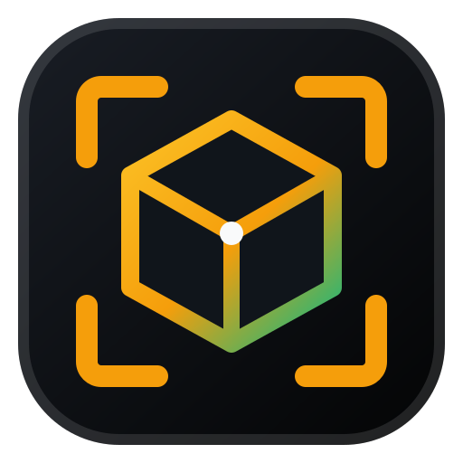
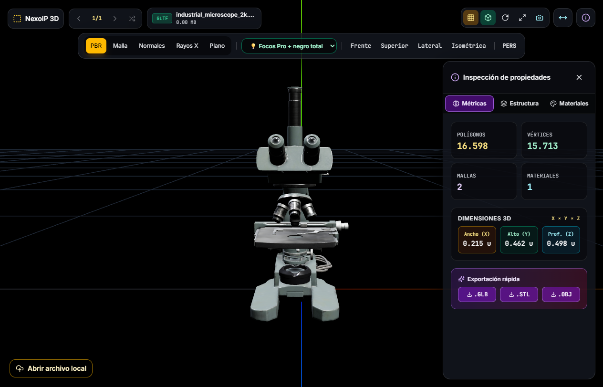

# NexoIP 3D Viewer

> [!WARNING]
> **Alpha technical preview.** `v1.0.0` is an evaluation build, not the stable product target. Format fidelity, accessibility, resource limits and Windows signing are being hardened against the public [product-readiness gates](docs/PRODUCT_READINESS.md). Do not treat the current binaries as production-ready.

<p align="center">
  
</p>

<p align="center">
  A private, offline-first desktop viewer for inspecting local 3D assets on Windows.
</p>

<p align="center">
  <a href="https://github.com/ikerperez12/NexoIP-3D-Viewer/actions/workflows/ci.yml"></a>
  <a href="LICENSE"></a>
  
  
</p>

<p align="center">
  <a href="docs/README.es.md">Español</a> ·
  <a href="https://github.com/ikerperez12/NexoIP-3D-Viewer/releases/tag/v1.0.0">Alpha download</a> ·
  <a href="SECURITY.md">Security</a> ·
  <a href="CONTRIBUTING.md">Contributing</a>
</p>



Screenshot model: [Industrial Microscope by Lukas Walzer on Poly Haven](https://polyhaven.com/a/industrial_microscope), released under CC0 1.0. The model is used only for the screenshot and is not distributed with this repository.

## What the alpha does

NexoIP 3D Viewer opens and inspects local 3D assets without uploading them or starting a local web server. Add only the folders you choose, browse the resulting private catalog, or drag a compatible file directly into the app. Discovery is progressive: the first compatible model that passes a bounded structural preflight becomes available immediately, and further discoveries are published in brief batches while a selected folder is still being scanned. Opening an entry always runs the format loader's full parse and resource checks. The renderer receives bounded, revisioned catalog pages and opens folder nodes lazily, so a growing library is not copied wholesale for each refresh. There is no arbitrary cap on selected-folder depth, entry count, or model count; regular-file, canonical-path, per-file-size, and structural-preflight safeguards still apply.

The alpha recognises `.glb`, `.gltf`, `.obj`, `.stl`, `.fbx`, `.ply`, and `.dae`. The source and packaged matrices now exercise all seven extensions through ten real loads: animated GLB, external-buffer/textured glTF, required `EXT_meshopt_compression`, Draco, KTX2/Basis, textured multi-MTL OBJ, ASCII STL (with separate binary-colour unit coverage), static FBX, coloured PLY, and centimetre/Z-up textured/animated DAE. Those checks prove these representative paths inside the EXE; they do not promise complete scene, material, animation, or export fidelity for every file in a format. See the [current support matrix and stable-release contract](docs/PRODUCT_READINESS.md) before relying on a format.

- PBR, wireframe, normals, X-ray, and unlit render modes.
- Perspective and orthographic cameras, standard views, grid, axes, auto-rotation, and camera reset.
- Six studio-lighting presets, including a true black studio background.
- Geometry, dimensions, hierarchy, materials, and animation inspection.
- Working animation selection, playback, seeking, and speed controls.
- GLB, STL, and OBJ export plus PNG snapshots.
- Keyboard navigation and accessible names, status announcements, focus states, and reduced-motion support.
- Local Draco and Basis decoders plus bundled fonts: model viewing does not depend on a CDN.

## Alpha download for Windows

The existing installer and portable build are available from the [`v1.0.0` alpha technical preview](https://github.com/ikerperez12/NexoIP-3D-Viewer/releases/tag/v1.0.0):

| Asset | Use |
| --- | --- |
| `NexoIP-3D-Viewer-*-windows-x64-setup.exe` | Per-user installer with an uninstall entry |
| `NexoIP-3D-Viewer-*-windows-x64-portable.exe` | Standalone executable; no installation |
| `SHA256SUMS.txt` | Integrity hashes for release assets |
| `*.cdx.json` | CycloneDX software bill of materials |
| `THIRD_PARTY_NOTICES.txt` | Licenses and attribution for bundled components |

The alpha Windows binaries are not Authenticode-signed. Windows may therefore show a SmartScreen warning or an organisation policy may block them entirely. Verify the SHA-256 checksum before running a download; checksums establish integrity, not publisher identity. A future stable release will require a valid trusted signature and will fail its release gate if any executable is unsigned. See the [release verification guide](docs/RELEASE_VERIFICATION.md) for the reproducible alpha and future-stable procedures.

### Verify a download

```powershell
Get-FileHash .\NexoIP-3D-Viewer-1.0.0-windows-x64-portable.exe -Algorithm SHA256
Get-Content .\SHA256SUMS.txt
```

The values must match exactly. Never run a binary whose checksum differs. For manifest-wide checksum, signature, expected-publisher, timestamp, and GitHub provenance verification, follow the [full guide](docs/RELEASE_VERIFICATION.md).

## Privacy and security model

The desktop app has no telemetry, analytics, accounts, update beacon, or embedded HTTP server. It does not scan a disk automatically. A native Windows dialog is the only way to approve library folders, while drag-and-drop approves just the dropped model.

The Electron renderer is sandboxed and receives no filesystem paths or Node.js access. A narrow preload bridge exposes validated operations, models are referenced through opaque IDs, and a private `nexoip://` protocol serves only approved model assets and safe sidecar files. Navigation, pop-ups, permissions, webviews, and arbitrary external URLs are denied.

See [the security policy](SECURITY.md) and [architecture notes](docs/ARCHITECTURE.md) for the threat model and reporting process.

## Controls

| Input | Action |
| --- | --- |
| Left drag | Orbit |
| Right drag | Pan |
| Mouse wheel | Zoom |
| `←` / `→` | Previous / next model |
| `R` | Reset camera |
| Keyboard camera menu | Discrete orbit, pan, and zoom without dragging |
| Arrow keys while the viewport is focused | Pan the camera |

## Build from source

Requirements: Windows 10/11 x64, Node.js 24.12 or newer, and npm 11 or newer.

```powershell
git clone https://github.com/ikerperez12/NexoIP-3D-Viewer.git
Set-Location NexoIP-3D-Viewer
npm ci
npm run check
npm run dev
```

Create local Windows packages with:

```powershell
npm run dist:win
```

Generated packages are written to `release/` and intentionally excluded from Git. Official binaries are published only as GitHub Release assets.

## Quality gates

Every pull request runs ESLint, unit tests, a production renderer build, dependency auditing, and CodeQL. GitHub's read-only dependency review additionally evaluates high-severity runtime dependency changes in every pull request. Tagged releases rebuild from the lockfile on a GitHub-hosted Windows runner, generate checksums and an SBOM, attest the Windows binaries and SBOM independently, and verify the draft-release bytes after upload before publication.

```powershell
npm run lint
npm test
npm run build
npm audit --audit-level=high
npm run test:e2e
npm run dist:win
npm run test:release-artifacts
```

`npm run test:e2e` and the hosted `npm run test:smoke:ci` gate verify every Electron 43 fuse, prove that the distributed executable rejects debugging transports, start the real packaged application without CDP, exercise the preload bridge and private `nexoip://` model protocol, and load ten real fixture scenarios covering every advertised extension plus Draco, Meshopt and KTX2/Basis decoding. They also verify the four bundled Draco/Basis runtime files. The packaged self-test records targeted evidence at a 900x600 window and 200% browser zoom: essential actions remain reachable, global overflow is absent, and the discrete camera keyboard alternatives respond. This is a focused regression gate, not a WCAG conformance claim.

After `npm run dist:win`, `npm run test:release-artifacts` refuses to run when it detects an existing NexoIP installation state, silently installs NSIS into unique temporary install and data directories on the guarded host profile, runs the same ten-load capability matrix, removes the state it created, and exercises the portable executable. Loader unit tests use a redistributable, SHA-256-pinned corpus for animated GLB, external glTF, required Meshopt/Draco/KTX2, textured multi-MTL OBJ, textured/animated DAE, static FBX, STL and PLY; fixture provenance is recorded beside the corpus.

These are alpha baseline checks. They do not yet prove complete fidelity for every variant of each format, WCAG 2.2 AA at Windows scaling extremes, long-running GPU stability, a clean Windows 10/11 test matrix, or Authenticode identity. The additional required evidence is tracked in [Product readiness](docs/PRODUCT_READINESS.md).

## Known limitations

- `v1.0.0` is an alpha technical preview; there is no supported stable release yet.
- Windows x64 is the only supported release target today.
- Format support is representative rather than exhaustive as described in the [support matrix](docs/PRODUCT_READINESS.md); an accepted extension does not yet guarantee full material, texture, animation, scene or export fidelity.
- Linked resources supported by a format loader must live beside the approved model and use an allowlisted local sidecar format.
- Dimensions are reported in the model's own unit (`u`); source formats do not always define a real-world scale.
- Very large or malformed assets may be rejected to protect responsiveness and memory usage.
- Alpha binaries are unsigned; a stable release is blocked until trusted signing is configured.

## Contributing and license

Please read [CONTRIBUTING.md](CONTRIBUTING.md) and the [Code of Conduct](CODE_OF_CONDUCT.md) before proposing a change. Security problems belong in a private report, not a public issue.

Released under the [MIT License](LICENSE). Bundled components retain their licenses and attribution in [THIRD_PARTY_NOTICES.txt](THIRD_PARTY_NOTICES.txt). Copyright © 2026 Iker Perez / NexoIP.
